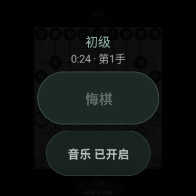
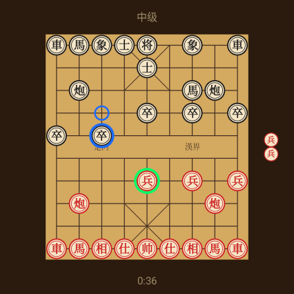

# WatchChess 象棋

Chinese Chess (Xiangqi) for Wear OS — play on your wrist.

<p align="center">
  
  
</p>

## Features

- Full Chinese Chess board optimized for round watch displays
- AI opponent with 4 difficulty levels (alpha-beta search with opening book)
- Move & capture sound effects
- Haptic feedback on every interaction
- Game timer & move counter
- Undo (reverts both your move and AI's response)
- Background music (toggleable)
- Long press to open in-game menu

## Controls

| Action | Gesture |
|--------|---------|
| Select piece | Tap |
| Move piece | Tap legal position (green dot) |
| Open menu | Long press |
| Reset after game over | Tap anywhere |

## AI Engine

Pure Kotlin alpha-beta pruning with:
- Iterative deepening & aspiration windows
- Transposition tables (Zobrist hashing)
- Null move pruning & late move reductions
- Killer move & history heuristics
- MVV-LVA move ordering
- Quiescence search
- Opening book (~40 patterns)

## Requirements

- Wear OS 3.0+ (API 30)
- Tested on Pixel Watch 4

## Build

```bash
./gradlew assembleDebug
adb install app/build/outputs/apk/debug/app-debug.apk
```
